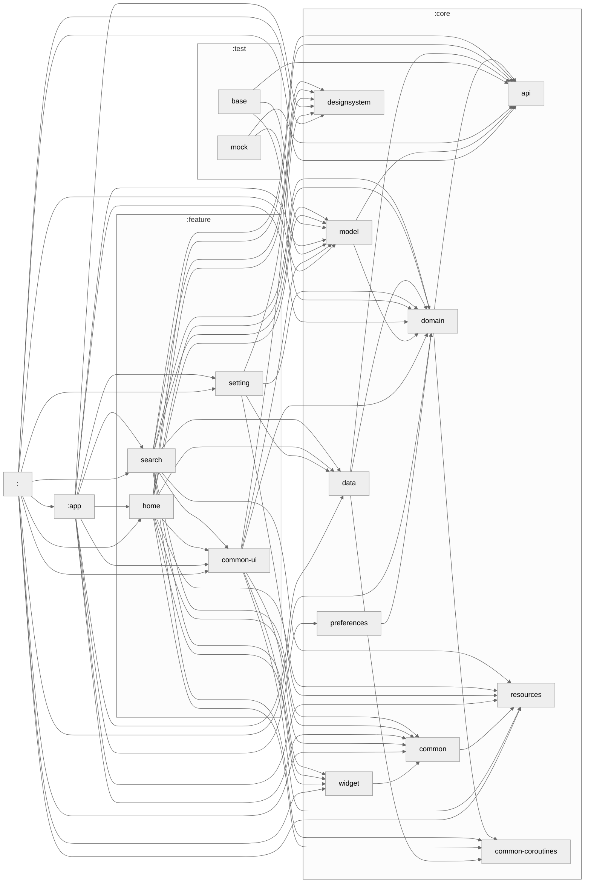

# Module Graph

```mermaid
%%{
  init: {
    'theme': 'neutral'
  }
}%%

graph LR
  subgraph :core
    :core:widget["widget"]
    :core:common["common"]
    :core:preferences["preferences"]
    :core:domain["domain"]
    :core:model["model"]
    :core:api["api"]
    :core:resources["resources"]
    :core:designsystem["designsystem"]
    :core:data["data"]
    :core:common-coroutines["common-coroutines"]
  end
  subgraph :feature
    :feature:home["home"]
    :feature:search["search"]
    :feature:setting["setting"]
    :feature:common-ui["common-ui"]
  end
  subgraph :test
    :test:mock["mock"]
    :test:base["base"]
  end
  :core:widget --> :core:common
  :core:preferences --> :core:domain
  : --> :core:model
  : --> :core:common
  : --> :core:api
  : --> :core:resources
  : --> :core:domain
  : --> :core:designsystem
  : --> :core:widget
  : --> :feature:home
  : --> :feature:search
  : --> :feature:setting
  : --> :feature:common-ui
  : --> :app
  :feature:common-ui --> :core:resources
  :feature:common-ui --> :core:common
  :feature:common-ui --> :core:widget
  :feature:common-ui --> :core:model
  :feature:common-ui --> :core:domain
  :feature:common-ui --> :core:designsystem
  :core:model --> :core:domain
  :core:model --> :core:api
  :test:mock --> :core:model
  :test:mock --> :core:api
  :core:common --> :core:resources
  :app --> :core:resources
  :app --> :core:common
  :app --> :core:model
  :app --> :core:data
  :app --> :core:domain
  :app --> :core:designsystem
  :app --> :core:preferences
  :app --> :feature:common-ui
  :app --> :feature:home
  :app --> :feature:search
  :app --> :feature:setting
  :test:base --> :core:model
  :test:base --> :core:api
  :test:base --> :core:domain
  :feature:setting --> :core:resources
  :feature:setting --> :core:data
  :feature:setting --> :core:domain
  :feature:setting --> :core:designsystem
  :core:data --> :core:common-coroutines
  :core:data --> :core:domain
  :core:data --> :core:api
  :feature:home --> :core:resources
  :feature:home --> :core:common
  :feature:home --> :core:common-coroutines
  :feature:home --> :core:widget
  :feature:home --> :core:model
  :feature:home --> :core:data
  :feature:home --> :core:designsystem
  :feature:home --> :core:domain
  :feature:home --> :feature:common-ui
  :feature:home --> :core:api
  :feature:search --> :core:resources
  :feature:search --> :core:common
  :feature:search --> :core:common-coroutines
  :feature:search --> :core:model
  :feature:search --> :core:domain
  :feature:search --> :core:designsystem
  :feature:search --> :core:widget
  :feature:search --> :feature:common-ui
  :feature:search --> :core:api
  :feature:search --> :core:data
  :core:domain --> :core:common-coroutines
  :core:domain --> :core:api
```